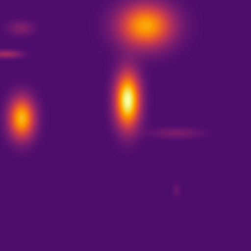
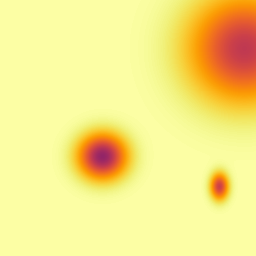
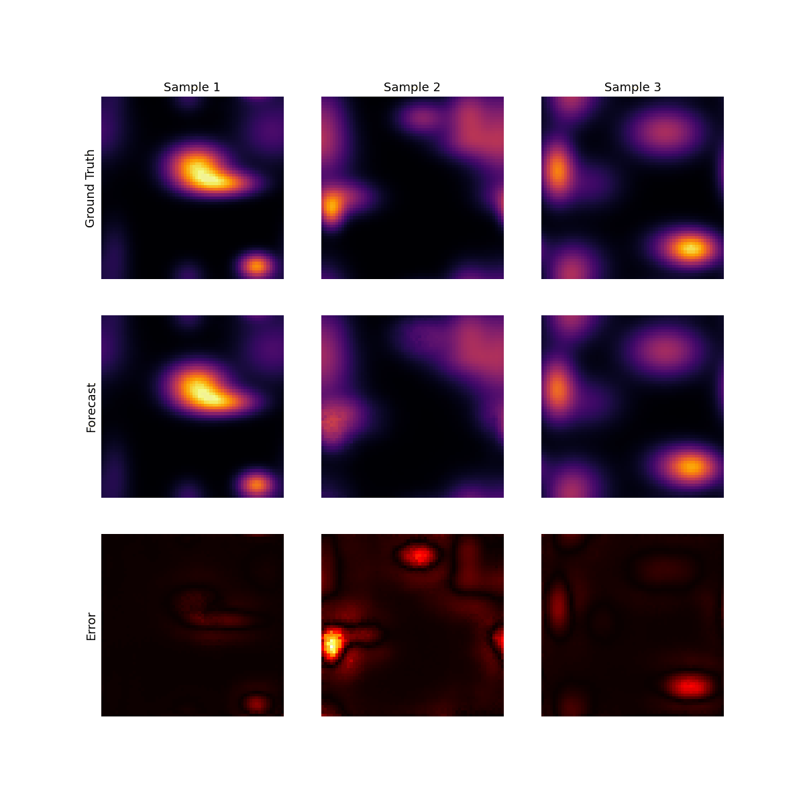

# ML for PDEs

> **Work in progress** — training ML models to solve partial differential equations.

## Goal

Train a **Diffusion model** and a **Neural Operator (FNO)** to learn solution operators for 2D PDEs from simulated data.

---

## Simulations

| Heat Equation | Wave Equation | Gray-Scott Reaction-Diffusion |
|:---:|:---:|:---:|
|  |  |  |
| Crank-Nicolson (ADI) | Leapfrog (explicit) | Strang splitting + Heun |

## Forecasting

Ground truth, DDPM forecast, and absolute error for three held-out heat equation test samples:

---

## TODO:
- [x] Training script for FNO
- [x] inference script
- [ ] inference script validation
- [ ] Visualisation script producing desired animation - target : Model1 : Model2 : Model3
- [ ] Link to WandB project
- [ ] Create report / add to website outlining stuff learned + theory with pretty visuals!
